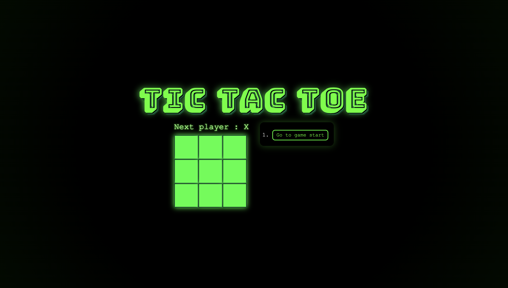

```

████████╗██╗ ██████╗      ████████╗ █████╗  ██████╗     ████████╗ ██████╗ ███████╗
╚══██╔══╝██║██╔════╝      ╚══██╔══╝██╔══██╗██╔═══██╗    ╚══██╔══╝██╔═══██╗██╔════╝
██║   ██║██║      █████╗ ██║   ███████║██║   ██║ █████╗ ██║   ██║   ██║███████╗
██║   ██║██║      ╚════╝ ██║   ██╔══██║██║   ██║ ╚════╝ ██║   ██║   ██║╚════██║
██║   ██║╚██████╗        ██║   ██║  ██║╚██████╔╝        ██║   ╚██████╔╝███████║
╚═╝   ╚═╝ ╚═════╝        ╚═╝   ╚═╝  ╚═╝ ╚═════╝         ╚═╝    ╚═════╝ ╚══════╝

```
🕹️ **Tic Tac Toe — Neon Edition**  
> A retro arcade remix of the React tutorial ⚡

---

## ✨ Preview



---

## 💻 Tech Stack

- ⚛️ **React** — UI + logic  
- 🎨 **CSS** — glowing neon grid  
- 🔤 **Bungee Shade** — arcade title font  

---

## 📂 Structure

```

tic-tac-toe/
├── public/
│   └── index.html
├── src/
│   ├── App.js
│   ├── Title.js
│   ├── index.js
│   └── styles.css
├── package.json
└── package-lock.json

````

---

## 🚀 Run Locally

```bash
npm install
npm start
````

Visit 👉 [http://localhost:3000](http://localhost:3000)

---

## 🎨 Theme

🟩 Neon green on deep black
🕹️ Retro vibes + flickering glow
⚡ Built entirely in React with custom CSS

> “Because even a tutorial deserves style.”

---

## 🧠 What I Learned

* React Components
* State & Props
* Time Travel logic
* Custom Styling & Layout

---

## 🧠 What I Changed

* Separate Components
* Used a for-loop logic for the grid
  
---

## 🔮 Future Ideas

* 🎧 Add arcade sound effects
* 🧑‍🎨 Player names & scoreboard
* 🌈 Animated win sequence
* 💾 Local storage for moves

---

## 👩‍💻 Author

**Chhavi Luthra**

> *Just coding in neon green.*

---

### ⚡ License

**MIT License** — free to use, remix, or glow brighter 💚

